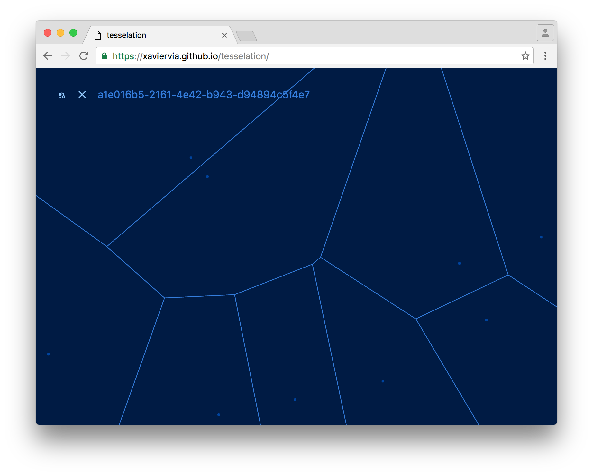
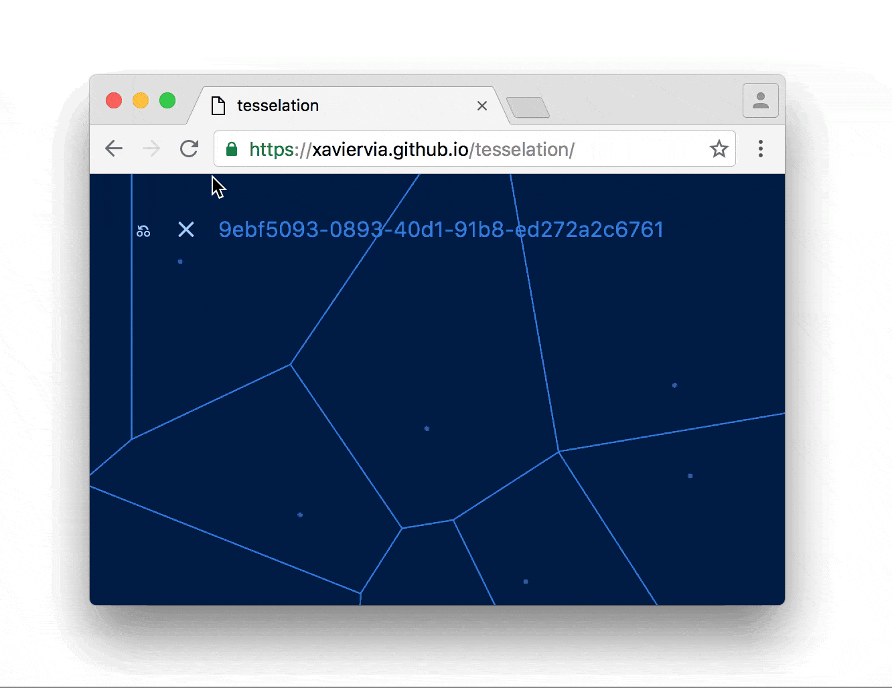
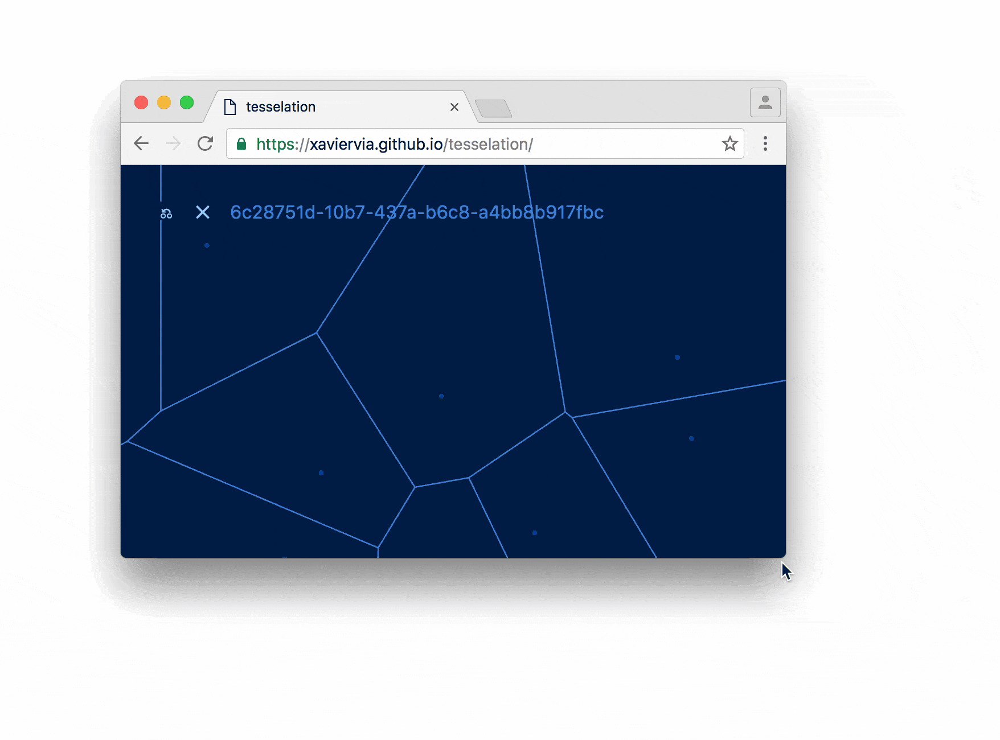
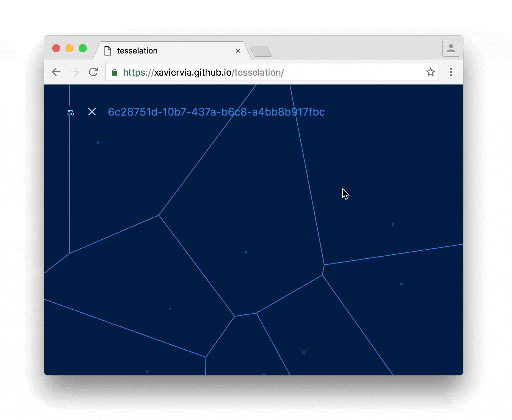
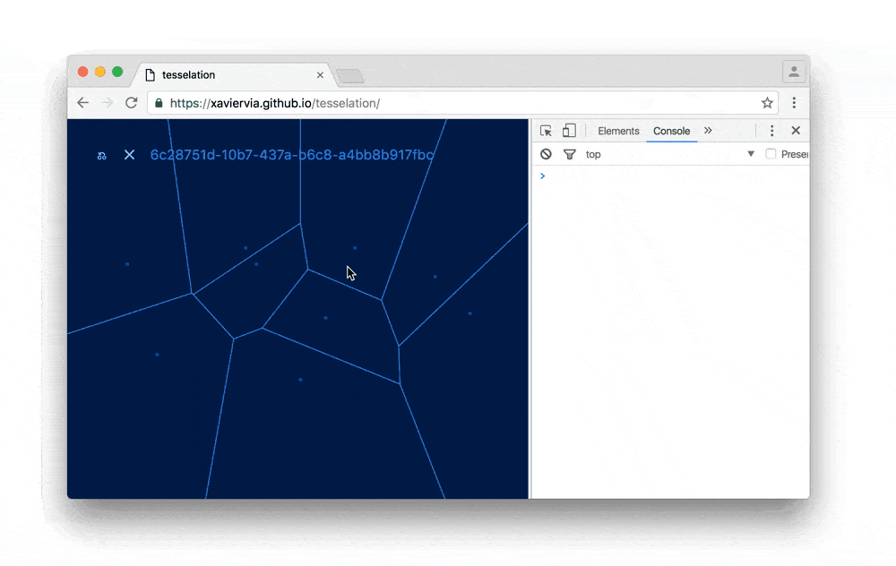
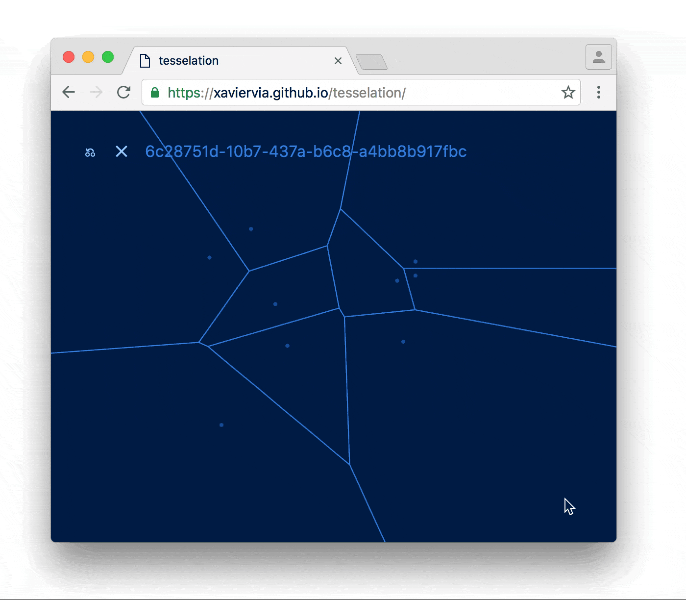
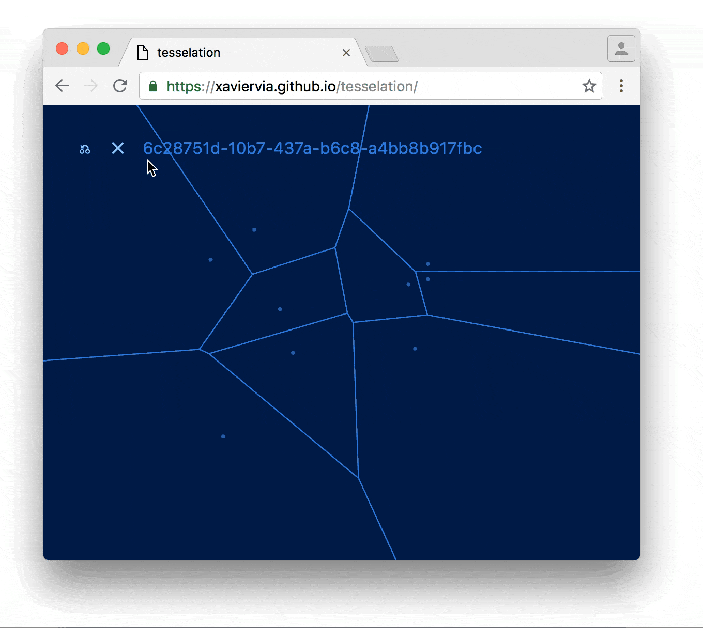
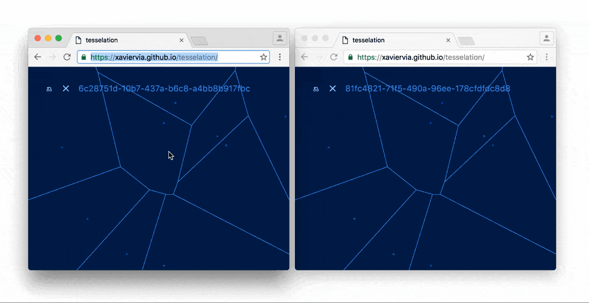

# Tesselation (thesis) - v0.1.0

> See the live application in [https://xaviervia.github.io/tesselation/](https://xaviervia.github.io/tesselation/)



> This app was tested and intended for a recent version of Chrome. It might not work somewhere else.

This project is a thesis on how to build front end applications.

**Tesselation** is a simple but not trivial application that keeps a set of points in the state and renders them as a [Voronoi tesselation](https://en.wikipedia.org/wiki/Voronoi_diagram) with a little help from [d3](https://d3js.org/) and [React](https://facebook.github.io/react/).

## Features

- Automatic saving locally in the browser.
- Automatic synchronization across browser tabs/windows.
- Logging updates to the console.
- Rendering a SVG diagram and doing mouse interactions with it.
- Seeding with random data.

The point is to explore a simple way of dealing with distinct types of side effects. These side effects are real requirements of many front end applications.

They also cover the full spectrum of [effect directionalities](#effect-directionality), so in theory any side effect could be implemented with the same APIs. More on that later.

## Principles

- The [core application logic](#core-application-logic) is purely functional: that is, it's done entirely with pure functions, and it's implemented using functional programming patterns.
- The core application logic [is composable](#composing-the-state-management-logic-from-smaller-pieces).
- [Side effects](#effects) are wired to the state using a reactive programming approach.
- All side effects are treated in the same way.
- Few libraries are used and they are used as little as possible.

### A note on the status of this thesis

Please don't take this project too seriously or assume that I'm completely sold on the ideas that I put together here. This is an experiment, and while I'm rather happy with the results, there are no simple answers in programming. It will also likely evolve, and if that's the case I'll continue publishing the new versions as I refine the ideas that make up the architecture.

## Libraries

There are several libraries used throughout this project. The architecture, however, is built so that none of these is indispensable to the underlying thesis, so don't get too fixated on the choice of libraries. It's extremely likely that the libraries will vary from context to context, while hopefully the underlying approach will not.

### Functional: [Ramda](ramdajs.com)

Ramda is the Swiss army knife of the functional programming community in JavaScript. It supports a close analog of the [Prelude](https://hackage.haskell.org/package/base-4.9.0.0/docs/Prelude.html) standard library of [Haskell](https://www.haskell.org/), and takes type signatures, performance, consistency and the functional principles very seriously. It provides a good foundation of functions that is lacking in the JavaScript standard library, and as such is extremely useful for building applications using functional programming principles.

That said, a lot of the functions from Ramda can be found in plain modern ES when using something as the [Babel polyfills](https://babeljs.io/docs/usage/polyfill/). You can also find many of those in [lodash](https://lodash.com/), [1-liners](https://github.com/1-liners/1-liners), etc.

### Reactive: [Flyd](https://github.com/paldepind/flyd)

Flyd is the most minimalistic and elegant reactive programming library that I could find. It provides an extremely easy way of creating streams a no-nonsense way of dealing with them. It follows the [fantasy-land](https://github.com/fantasyland/fantasy-land) specification, which means Flyd streams interoperate fantastically with Ramda (although I'm not making use of that at all in this project).

There are many alternatives to Flyd out there. For the architecture suggested here, maybe the most relevant is [Redux](redux.js.org) itself, but if you are looking for a more complete reactive programming toolkit you can take a look at [most](https://github.com/cujojs/most) or [Rx](https://github.com/Reactive-Extensions/RxJS).

### Rendering: [React](https://facebook.github.io/react/)

I'm assuming React needs no introduction. The point here is that _not even React_ is necessary for this architecture to work. Of course, as long as the side effects are treated as a function that is called each time a new state is generated, a reactive UI library is ideal for the wiring to be simple to do. But React is not alone there: you can also try out [Preact](https://github.com/developit/preact), or [Act](https://github.com/act-framework/act), or [virtual-dom](https://github.com/Matt-Esch/virtual-dom) directly.

## Let's get started

First, open the live app in [https://xaviervia.github.io/tesselation/](https://xaviervia.github.io/tesselation/).

You are watching a very simple example of a [Voronoi tesselation](https://en.wikipedia.org/wiki/Voronoi_diagram), a kind of cell diagram automatically generated from points spread across a plane. There are 9 points in total.

If this is the first time you open the application, the distribution of dots that you see is random, and was generated by the [Seed](#seed) effect.

Let's play around:

### 1. Reload the application



The distribution of dots doesn't change! This is because each time the state is updated, the new distribution of dots is saved by the [LocalStorage effect](#localStorage) into, well, `localStorage`. When you reload, the same LocalStorage effect recovers the points from there.

### 2. Resize the window



The tesselation changes it's proportions to fit the new window size. Each time you resize the window, the [Resize effect](#resize) pushes a new action. The app recalculates the positions of the dots and lines by skewing the 100x100 grid.

### 3. Click around



One dot is removed, and another dot is aded in roughly the position where you clicked.

> It will be placed _roughly_ where the mouse was because positions are normalized from whatever size your window is to a 100x100 grid, so the application's grid doesn't match the pixels that you see. This action is sent from the [View effect](#view) – which is a React component.

### 4. Open the console and click around



Each new distribution of dots is logged to the console. The [Log effect](#log) is responsible for this.

Try clicking several times in the same place without moving the mouse: you will see that the distribution of dots is printed only once. The state management part of the application is taking care of not sending the same state twice to the effects. We will see this later in more detail.

### 5. Click the `⎌` (undo) button



The point distribution goes back to the previous one. How this is achieved is an interesting part of the state manipulation and [state logic composition](#state-logic-composition) exploration.

### 6. Click the `✕` (reseed) button



A new random distribution of dots appears.

### 7. See two windows synchronized



Finally, open another browser window, go to [https://xaviervia.github.io/tesselation/](https://xaviervia.github.io/tesselation/), put it side by side with the current one, and click around in one and the other: you would see that both update at the same time, completely synchronized. This is also done by the [LocalStorage effect](#localstorage)

> There is a bug caused by a race condition that you can trigger having the windows side by side. We will discuss it later, but see if you can find it if you want.

## Core application logic

The application logic is contained in the files placed directly under the `src` and the `src/reducers` folders.

- `actions.js` contains the constant declarations for the action types. I'm trying out using Symbols for action types constants. Symbols make for great action types because each Symbol is totally unique, which means that collision between them is impossible. I took inspiration for this from [Keith Cirkel's Metaprogramming in ES6: Symbol's and why they're awesome](https://www.keithcirkel.co.uk/metaprogramming-in-es6-symbols/). Take this with a grain of salt: I haven't tried it outside Chrome or in a real life app.

- `index.html` is the HTML entry point. [Sagui](https://github.com/saguijs/sagui) will configure [Webpack](https://webpack.github.io/) to load it with the corresponding `index.js`.

- `index.js` is the JavaScript entry point. It's the only place where the effects meet the store, and the place where the application wiring is done. Note that, unlike in many other React applications, the `index.js` is _not in charge of rendering_: rendering the view is considered just another effect. Rendering is not part of the core of the application.

  > This doesn't mean that rendering is not _important_. As stated below, [effects are the whole point of an application](#effects). Saying that rendering is not part of the core means only that rendering is not state management logic.

- `lenses.js` is the only file that is, to some extent, a **Ramda** artifact. Ramda provides this really cool functionality for selecting values in nested object structures that is done via [`lensPath`](http://ramdajs.com/docs/#lensPath) functions, which combined with [`view`](http://ramdajs.com/docs/#view) and [`set`](http://ramdajs.com/docs/#set) make for great ways of querying and immutably setting values in a complex state object. I still haven't decided what to do with this file.

- `selectors.js` contains the functions that make it easy to query the state blob.

- `store.js` contains the initial state blob and the reducer, which is in turn built from all the high order reducers in `reducers/`.

- `reducers/` contains files with each of the high order reducers.

It's important to notice that, with the exception of `index.js`, _all of the above contain only pure functions_. There is nothing weird going on in them, and any complexity in the code is derived mostly from the complexity of the application functionality itself. I consider this one of the biggest achievements of this proposed architecture.

> Note: the `reducers/debuggable.js` high order reducer is also not pure, but the intent of that reducer is just to introspect the state while in development, so it doesn't really count.

The whole application state is contained in a single object blob, Redux-style. Actually, the whole architecture is heavily inspired by Redux, but with two core differences:

- To prove that the "single object" state approach goes beyond libraries and it's easily reproducible with any reactive programming library, it's not using Redux itself.
- It is highly decoupled from the UI: Redux was originally meant to represent the data necessary to drive the UI, and the patterns that emerged around it reflect that intent. The thesis here is that the way Redux drives state can be used to manage any type of side effect, and for that purpose I introduced a generalized wiring interface that, the thesis goes, can be used for _any_ side effect.

To emphasize the fact that the architecture is meant to be a generalization of Redux and not another Flux implementation (as in, another way of doing React), the nomenclature is slightly different:
- `dispatch` is called `push` to represent the fact that the actual operation of dispatching an action is analogous to pushing into an array structure. As a matter of fact, it's pushing data into a stream that gets reduced on each addition – or `scan`ned in Flyd lingo.
- There is no `getState`. State is pushed to the effects as an object each time the store gets updated.

### Composing the state management logic from smaller pieces

Redux reducer composition is sometimes done with the [`combineReducers`](http://redux.js.org/docs/api/combineReducers.html) utility. `combineReducers` segments the state into several disconnected namespaces that the reducers target separately. In the past I had real problems with this approach though: long story short, keeping reducers from affecting each other lead us to manufacture artificial actions whose only purpose was to be able for some reducers to affect parts of the state outside their reach. I even [built a middleware for that](https://github.com/xaviervia/redux-walk). It was messy. I take it as a cautionary tale.

The documentation itself warns about `combineReducers` [being just a convenience](http://redux.js.org/docs/api/combineReducers.html#tips). After we noticed that I tried exploring alternative ways of working with several reducers.

I came to favor a different approach altogether:

## High order reducers

In this project I wanted to explore a pattern for composition of reducers that I first saw presented in React Europe for [undoing](https://github.com/omnidan/redux-undo): high order reducers. In a nutshell, that means that instead of implementing your most basic reducer as:

```javascript
const reducer = (state, action) => {
  switch (action.type) {
    case 'ADD':
      return state + 1

    default:
      return state
  }
}
```

...you take another reducer as the first argument and pass it through when you are not interested in the current action:

```diff
- const reducer = (state, action) => {
+ const highOrderReducer = (reducer) => (state, action) => {
  switch (action.type) {
    case 'ADD':
      return state + 1

    default:
-      return state
+      return reducer(state, action)
  }
}
```

The advantages are plenty, but the main hidden one I discovered is that this means is very natural to make your high order reducers parametrizable, which means they can be _reusable_. In a silly example, let's say that you want to reuse the above shown _addition_ reducer, and in each specific application you want to use a different value for the action type and a different name for the property of the state that has to be affected. Then you could write your HOR (High Order Reducer) as follows:

```javascript
const additionHighOrderReducer = (property, actionType) => (reducer) => (state, action) => {
  switch (action.type) {
    case actionType:
      return {
        ...state,
        [property]: state[property] + 1
      }

    default:
      return reducer(state, action)
  }
}
```

The other obvious advantage is that a HOR can manipulate the result of another reducer, introducing the intriguing possibility of performing meta-actions in the state.

### The undoable high order reducer

The following is the very simple implementation of the undoable HOR that can be found in `src/reducers/undoable.js`:

```javascript
export default (actions) => (reducer) => (state, {type, payload}) => {
  const {undo, ...restOfState} = state // eslint-disable-line no-unused-vars

  switch (type) {
    case actions.APP_UNDO:
      return state.undo

    default:
      const newState = reducer(state, {type, payload})

      return newState !== state
        ? {
          ...newState,
          undo: restOfState
        }
        : newState
  }
}
```

Notice how the `default` action is running the reducer that it received as an argument and checking if it's result differs from the previous state. In case it is different, it will not just return the new state: it will also add an `undo` property to the new state with a reference to the old state. To actually perform the _undoing_, it's as simple as returning `state.undo`.

### High order reducer composition

The `undoable` demonstrate the kind of power that HORs bring, but of course not all HORs need to be meta: using HORs even when no meta operations are done is valuable because HORs can be composed together, while plain reducers can't. How would that look like?

Well, simple enough:

```javascript
const reducer = compose(
  undoable(APP_UNDO),
  appHOR,
  pointsHOR
)((x) => x)
```

Two important things to notice here:

1. To get an actual reducer out of a HOR, you need to call it with another reducer. The simplest possible reducer is the _identity function_: that is, the function that returns whatever argument it gets. Think about it: a reducer that gets a state and returns that same state is still a reducer.

  We could build the composition with a real reducer instead of using _identity_, but that would break the symmetry of the whole thing, since one of the parts of the application will not be a HOR.

2. Since the _undo_ HOR intercepts the result of the other reducers, it needs to be the last element of the composition. Otherwise it would only operate in the identity function. Remember: `compose` works from right to left, so the above expression translates to:

  ```javascript
  const reducer = undoHOR(APP_UNDO)(appHOR(pointsHOR((x) => x)))
  ```

> You can see a variation of this in `src/store.js`. The actual implementation is more complex because it requires the full action dictionary to be passed in to each high order reducer: but that's an implementation detail of which I'm not completely sure about.

Any number of HORs can be chained in this way. Hopefully we can explore further if by adding more detailed configuration as to where in the state to do the modifications and what action names to respond to it becomes possible to have truly reusable application logic parts in the form of high order reducers.

## Effects

Now to the fun part.

The application store can be seen as a _stream_. A stream gets updated continuously each time that something is pushed into each, and then it gets split into several streams that each land into a different effect. That is the conceptual picture: the actual implementation will vary. For example: while this schema is true for how Redux work, the Redux store is not an actual reactive stream, and even in this application the store stream is not literally split and sent down to the effects. But the analogy still holds.

> Here comes a semantic side note: I'm calling these _effects_ instead of _side effects_ because, as many pointed out, an application without side effects is just a way of transforming electricity into heat. _Effects_ is a correct name: the purpose of applications is in fact to perform effects. Side effects on the other hand refer to the _unintended consequences_ of performing an otherwise functional operation. In informal contexts I will use _effect_ and _side effect_ interchangeably, but I'll try to stick to _effects_ whenever nomenclature is important.

### Effect directionality

Effects come in different flavors:

- **Incoming**: Effects that only inject data into the application. [Resize](#resize-effect) and [Setup](#setup-effect) are examples of this type.

- **Outgoing**: Effects that react to the new state by performing some operation, but never inject anything back. [Log](#log-effect) is an Outgoing Effect.

- **Bidirectional**: Effects that react to the state _and_ inject information back into it via actions. [LocalStorage](#localstorage-effect), [Seed](#seed-effect) and [View](#view-effect) are of this type.

Notice that there is no implication whatsoever that incoming and outgoing effects need to be synchronous. As a matter of fact, incoming effects are like hardware interruptions: they are asynchronous and will come at an arbitrary time. This is how the architecture proposed here manages asynchronous operations: if the result of the operation is important to the application state, an asynchronous effect will capture some state change and perform some operation somewhere, only to push an action back into the state whenever (and if) the operation is completed. Notice that as far as the application state is concerned, the temporality between those two events is completely irrelevant.

> You can easily imagine constructing REST requests with this approach: say that an blog post was just submitted by the user: somewhere in the application state, there will be a sign that the REST communication effect will read and realize that a backend call needs to be performed: when that backend call is completed, it will push an action into the state signifying that the post was saved, or that a retry is necessary.
>
> But I digress.

Categorizing the effects into these three types is not terribly useful: knowing if an effect is **Incoming**, **Outgoing** or **Bidirectional** doesn't say much about what it does. The reason I explain about it however is because it sheds some light into the _why_ of the Effect Wiring API.


### Effect Wiring API

Effects are wired to the store with a simple API: each effect is a function with the signature (in [Flowtype annotations](https://flowtype.org/)):

```javascript
type FluxAction = {
  type: Symbol,
  payload: any
}

type Effect = (push: (action: FluxAction) => void) => ?(state: any) => void
```

Logging to the console each time the state is updated is easy enough:

```javascript
export default () => (state) => console.log(state)
```

Another thing that you can do is to push an action when the application is being set up. This is useful for initializing values on startup. In this case we can use a little API sugar: since the `(state: any) => void` part of the signature is optional (preceded by a `?`) we can push directly:

```javascript
import {RANDOM_VALUE} from 'actions'

export default (push) => push({
  type: RANDOM_VALUE,
  payload: Math.random()
})
```

### LocalStorage effect

> [code](src/effects/localStorage.js)

When first invoked, it checks if there is an entry in `localStorage` for `tesselation`, and if there is, it immediately pushes an action with the previously saved state. It also sets up a listener on the window `storage` event, and whenever said `tesselation` entry is updated it pushes another state override, thus keeping it in sync with whatever other instance of the application is running in a different window or tab (this will conspire with another effect and come back to bite us in one of the gotchas).

```javascript
import {APP_SYNC} from 'actions'

export default (push) => {
  if (window.localStorage.getItem('tesselation')) {
    push({
      type: APP_SYNC,
      payload: JSON.parse(window.localStorage.getItem('tesselation'))
    })
  }

  window.addEventListener('storage', ({key, newValue}) => push({
    type: APP_SYNC,
    payload: JSON.parse(newValue)
  }))

  return (state) => window.localStorage.setItem(
    'tesselation',
    JSON.stringify(state.shared)
  )
}
```

### Log effect

> [code](src/effects/log.js)

Logs the current points with a nice format.

```javascript
import leftPad from 'left-pad'
import {point} from 'selectors'
import {compose, join, map} from 'ramda'

const p = (index) => compose(
  join(','),
  map((value) => leftPad(value, 2, 0)),
  point(index)
)

// Intentionally manual
export default () => (state) => point(0)(state) &&
  console.log(
`
  ⎢ ${p(0)(state)} ${p(1)(state)} ${p(2)(state)} ⎢
  ⎢ ${p(2)(state)} ${p(4)(state)} ${p(5)(state)} ⎢
  ⎢ ${p(6)(state)} ${p(7)(state)} ${p(8)(state)} ⎢

`
)
```

### Resize effect

> [code](src/effects/resize.js)

Listens to `resize` events on the window and pushes an action with the new value:

```javascript
import {APP_RESIZE} from 'actions'

export default (push) => {
  push({
    type: APP_RESIZE,
    payload: {
      height: window.innerHeight,
      width: window.innerWidth
    }
  })

  window.addEventListener('resize', () => push({
    type: APP_RESIZE,
    payload: {
      height: window.innerHeight,
      width: window.innerWidth
    }
  }))
}
```

### Seed effect

> [code](src/effects/seed.js)

If the state doesn't already have any points, it seeds the application with 9 random points.

```javascript
import {map, range} from 'ramda'
import {APP_SEED} from 'actions'

const {floor, random} = Math

// This effect needs to be loaded last
// to avoid colliding with any state recovered from localStorage
export default (push) => (state) => state.shared.points.length === 0 &&
  push({
    type: APP_SEED,
    payload: map(
      () => [floor(random() * 100), floor(random() * 100)],
      range(0, 9)
    )
  })
```

### Setup effect

> [code](src/effects/setup.js)

When initialized, it immediately pushes an action with a newly generated UUID to identify the instance of the application. There is an interesting gotcha here: I initially modeled this as being part of the `initialState` object in the `store`, but you can see how that violates the purity of the store implementation. It's a common temptation to include "one off" effects in the creation of the `initialState`, but that is likely to create problems down the line. It's a good litmus test for the store implementation that no libraries with side effects are used in it.

```javascript
import uuid from 'uuid'
import {APP_SETUP} from 'actions'

export default (push) => {
  push({
    type: APP_SETUP,
    payload: {
      id: uuid.v4()
    }
  })
}
```

### View effect

> [code](src/effects/view.js)

> Too long to display inline

The view effect is simply a React component that is rendered using ReactDOM into the actual DOM tree. The little d3 magic responsible for getting the polygon information for the Voronoi diagram lies in there, but other than that it's a pretty regular React component. And that's the point here: the React integration doesn't look weird in any way, but also it doesn't look different from the integration of any other effect.

The interesting part in the React component is the small wiring that is done to tie the state of the Container component with the state passed in from the outside:

```javascript
let onState

class Container extends Component {
  componentDidMount () {
    onState = (state) => this.setState({
      storeData: state
    })
  }

  render () {
    if (this.state == null) {
      return false
    }

    const {storeData} = this.state
    ...
  }
}

...

return onState
```

That is literally it. On `componentDidMount` the `onState` function is setup so that each time it is called by the application it will update the `storeData` within the Container state. React will realize if the state actually changed, and inside the `render` function it's just a matter of checking for the state being defined or not (which could easily be avoided by setting an initial state, but I didn't want to cater for that scenario) and then the whole store state is available, one deconstruction away, in `storeData`. Selectors can readily be reused to query that data.

For pushing information back into the state, this is what we do:

```javascript
<Button
  onClick={() => push({ type: POINTS_CLEANUP })}
  title='reseed'>
  ✕
</Button>
```

Again, nothing differs between this and how any other effect is wired.

Other components that are not the container can (and should) be kept generic. Sending push or "untreated" chunks of the state down the React tree is a _nasty antipattern_, but this is also true when sending `dispatch` and/or `getState` in React Redux, so there is nothing new under the sun here.

## Debugging

How do I get something like the magnificent [Redux Chrome DevTools](https://github.com/zalmoxisus/redux-devtools-extension)?

I'm glad you ask. Actually, you can't get exactly that. The tools and documentation accompanying Redux are a great achievement of the developers and an excellent reason to keep using Redux in the short and middle term.

However! It's pretty easy to get useful debug information about the evolution of the state in any architecture that uses reducers as the cornerstone of state management. In the reducers folder, there is `debuggable` HOR that can be used to decorate our reducer function and get more insights.

There is a template for this in the `src/index.js`. If you want to try it out:

1. `git clone git://github.com/xaviervia/tesselation`
2. `cd tesselation`
3. `npm install`
4. In your editor, open the `src/index.js` and uncomment lines `4` and `12`, as instructed. Comment out line `10`
5. `npm start`
6. Open http://localhost:3000

Extending this debugging tool should be rather straightforward.

## Gotchas and easter eggs

The application has two bugs that were left there to demonstrate the kind of quirks that can emerge out of this architecture, and I will discuss here possible solutions.

**TODO**

## My personal take aways

- **Symbols** make for pretty cool action types.
- **High order reducers** open up a world of possibilities for reusable application state management functions.
- The **streams** could be useful in the effects as well. The point here was to keep the API library agnostic and minimize the use of Flyd, but I'm pretty sure streams can help out a lot when dealing with more complex incoming side effects, while still keeping the wiring API agnostic.
- **JSON Patch** diffs can be very useful for debugging and possibly for storing or sharing a log transformations. For example it could be useful to send the patches over a network to keep clients and servers synchronized.

## Credits and references

- [Redux](http://redux.js.org/) which "single reducer" idea heavily inspired this architecture.
- [@joaomilho](https://github.com/joaomilho) who originally gave me the idea of using [`flyd`](https://github.com/paldepind/flyd) to re implement the Redux store, and who's [Act framework](https://github.com/act-framework/act) and [Ion language](https://github.com/ion-lang/ion) motivated the wish to do more and more functional and reactive programming in JavaScript.
- [@Nevon](https://github.com/Nevon)'s [demystifying Redux](https://gist.github.com/Nevon/eada09788b10b6a1a02949ec486dc3ce)

---

- [Sagui](https://github.com/saguijs/sagui) is a great way of bootstrapping and building a modern web application without thinking about configuration.
- [Tachyons](http://tachyons.io/) made the styling a breeze.
- [d3](https://d3js.org)'s heavily mathematical approach made it a great tool to work together with Ramda and React.
- [jiff](https://github.com/cujojs/jiff) is very useful to get JSON diff's between states; diffs that, since they follow the [JSON Patch RFC6902](https://tools.ietf.org/html/rfc6902), can then be applied to the state structure to reproduce the transformation.

## License

[The Unlicense](LICENSE)
